# Kaprekar Dynamics

### An exhaustive study of 6174 and generalized Kaprekar systems

An exhaustive computational study of Kaprekar's routine, from the classical four-digit 6174 problem to generalized fixed-width systems in bases 2–16. The project combines complete state-space enumeration, graph analysis, symmetry reduction, and a finite proof of the classical seven-step bound.

## Key findings

- **10,000** classical decimal states were exhaustively analyzed.
- **9,990 out of 9,990** non-repdigit states converge to `6174`.
- **7 transformations** is the exact maximum; 2,184 states attain it.
- The classical state space contracts from **10,000 ordered states to 715 digit multisets to 55 first-step outputs**.
- **75 generalized systems** were analyzed exactly, revealing **199 attractors**, transient depths up to **31**, and cycles up to length **14**.

## Key insight

For descending digits $a \ge b \ge c \ge d$, define $x=a-d$ and $y=b-c$. Then

```text
K(n) = 999(a − d) + 90(b − c) = 999x + 90y

10,000 ordered states  →  715 digit multisets  →  55 first-step outputs
```

This many-to-one contraction is the central structural reason the classical routine converges so quickly.

## Why this is interesting

The classical 6174 phenomenon is often presented as a numerical curiosity: repeatedly rearranging and subtracting four decimal digits somehow leads to the same constant. The exhaustive state-space analysis shows that the behavior is less mysterious when viewed as a finite dynamical system.

Digit permutation immediately removes most positional information, and the four-digit transformation can be expressed using only two digit differences. The generalized census also shows that this behavior is not universal: other bases and widths can have multiple attractors and non-trivial cycles. The familiar four-digit decimal case is therefore a particularly simple member of a much richer family of finite dynamical systems.

> **Scope of contribution.** Convergence to 6174 and the seven-step upper bound are established mathematical results. This repository independently reproduces them exhaustively, characterizes the complete state space and maximum-depth cases, supplies a computer-checkable 55-pair certificate, and extends the analysis to 75 base-and-width systems.

## Contents

- [Part I — The classical four-digit decimal system](#part-i--the-classical-four-digit-decimal-system)
- [Part II — Generalized Kaprekar systems](#part-ii--generalized-kaprekar-systems)
- [Part III — Finite proof certificate](#part-iii--finite-proof-certificate-for-the-seven-step-6174-bound)
- [Reproducibility](#reproducibility)
- [Artifact index](#artifact-index)
- [References](#references)

## Part I — The classical four-digit decimal system

### 1. Introduction

Dattatreya Ramachandra Kaprekar (1905–1986) was a largely self-taught Indian mathematician and school teacher whose work centered on elementary number theory and digit phenomena [2]. The bibliographic record for his original description of the routine is *Another Solitaire Game*, published in volume 15 of *Scripta Mathematica* in 1949 [1]. The routine later became a standard example of iteration, fixed points, and equivalence-class reduction; Deutsch and Goldman, for example, framed the problem in exactly those terms [3].

The rule is exceptionally simple. Given four digits, form their descending and ascending arrangements and subtract the latter from the former. Repeating this operation from a non-repdigit state is known to reach 6174 in at most seven transformations. Yet the usual pencil-and-paper demonstration leaves several questions unanswered:

1. Does the statement hold for all 10,000 four-character strings, including those with leading zeros?
2. What happens to repdigits, and are any other cycles hidden in the state space?
3. How are convergence times distributed, and which states actually require seven steps?
4. How much of the apparent 10,000-state complexity is redundant under digit permutation?
5. What does the complete directed transition graph look like, and why does it collapse so quickly?

This project answers those questions by combining exhaustive computation, independent validation, combinatorial reduction, and graph analysis. It distinguishes known literature claims from results reproduced by this experiment. In particular, the familiar seven-step bound is a known theorem and published result [3, 4]; every numerical count and statistic below is independently regenerated here from `data/kaprekar_results.csv`.

### 2. Mathematical Background

#### 2.1 The transformation and leading zeros

Let $S=\{0,1,\ldots,9999\}$, interpreted as four-digit strings. If the digits of $n\in S$ are rearranged in descending order to form $D(n)$ and ascending order to form $A(n)$, define

```text
K(n) = D(n) − A(n).
```

The result is returned to a four-character representation before the next step. For example,

```text
1000 -> 1000 - 0001 = 0999
0999 -> 9990 - 0999 = 8991.
```

Dropping the leading zero would change the digit width and therefore define a different dynamical system. Modern treatments of generalized Kaprekar transformations explicitly emphasize retaining it [4, 6]. Internally, this project stores a state as an integer but calls `normalize_state` before every digit operation.

A repdigit has the form `dddd`, including `0000`. Its ascending and descending arrangements coincide, so every repdigit maps to `0000`, which then maps to itself. Repdigits are therefore retained as a distinct basin rather than silently excluded.

#### 2.2 Fixed points, cycles, and trajectories

The map $K:S\rightarrow S$ is deterministic: every node has exactly one outgoing edge. Because $S$ is finite, every forward trajectory must eventually repeat, hence must enter a directed cycle [6]. A cycle of length one is a fixed point. The transient distance $d(n)$ is the smallest number of transformations required to reach the first state on the terminal cycle.

For a state that reaches 6174, this report writes $T(n)$ for the smallest $t\ge0$ such that $K^t(n)=6174$. Consequently,

```text
3524 -> 3087 -> 8352 -> 6174
```

has $T(3524)=3$, whereas $T(6174)=0$. This convention counts edges, not states displayed. Stored audit trajectories include one final repeat, so the corresponding CSV entry ends `6174 -> 6174`.

#### 2.3 Algebraic reduction

Let the four digits, arranged from largest to smallest, be `a ≥ b ≥ c ≥ d`. The descending and ascending numbers are

```text
D = 1000a + 100b + 10c + d
A = 1000d + 100c + 10b + a
```

Subtracting gives

```text
K(n) = D − A
     = 999a + 90b − 90c − 999d
     = 999(a − d) + 90(b − c).
```

Now define the two digit gaps

```text
x = a − d          y = b − c.
```

The inner interval `[c,b]` lies inside the outer interval `[d,a]`. Consequently,

```text
0 ≤ y ≤ x ≤ 9.
```

Conversely, every integer pair satisfying those inequalities is attainable: the sorted digits `(a,b,c,d) = (x,y,0,0)` realize it. The number of feasible pairs is therefore

```text
1 + 2 + ⋯ + 10 = 10 × 11 / 2 = 55.
```

These 55 pairs also give 55 distinct outputs. Suppose two pairs give the same result:

```text
999x + 90y = 999x′ + 90y′.
```

After rearranging and dividing by 9,

```text
111(x − x′) = −10(y − y′).
```

If `x − x′` were nonzero, the left side would have magnitude at least 111. The right side has magnitude at most 90 because both `y` and `y′` lie between 0 and 9. Hence `x = x′`, and the original equality then forces `y = y′`. Thus the mapping `(x,y) → K(n)` is one-to-one on the feasible triangle.

This algebra already predicts the most dramatic computational result: 10,000 inputs can have only 55 different successors.

#### 2.4 Permutation equivalence

The first transformation depends only on which digits occur and how often they occur—not on their original order. Therefore all permutations of the same four-digit multiset have identical descending and ascending arrangements and the same first successor.

The number of four-symbol multisets drawn from the ten decimal digits is the combinations-with-repetition count

```text
C(10 + 4 − 1, 4) = C(13, 4) = 715.
```

Thus the 10,000 ordered states collapse to 715 permutation classes before any trajectory analysis is needed. If a multiset has digit multiplicities `m₀, m₁, …, m₉`, its exact number of ordered states is

```text
4! / (m₀! m₁! ⋯ m₉!).
```

Every state in one class shares the same first edge and therefore the same subsequent trajectory. The only depth nuance occurs when one particular ordering is itself a cycle member: that ordering has depth zero, while its other permutations take one step to the common successor. This is consistent with the broader “Kaprekar index” viewpoint, in which digit counts rather than positions determine the successor [6].

### 3. Methodology

#### 3.1 Complete search space

The experiment enumerated the exact integer range `range(10000)`, representing `0` as `0000`, `1` as `0001`, and so forth. A valid state was defined as one containing at least two distinct digits. All ten repdigits were still analyzed and stored. Results were also filtered to ordinary four-digit integers `1000–9999` so that claims about 9,000 integers would not be conflated with claims about 10,000 four-digit strings.

For each start, the dataset records:

- padded and numeric starting state;
- repdigit flag and number of distinct digits;
- sorted digit multiset and reduced coordinates $(x,y)$;
- descending component, ascending component, and first successor;
- trajectory through the first repeated state;
- first entry into the terminal cycle and distance to it;
- distances to 6174 and 0000 when applicable;
- terminal cycle, length, and classification.

#### 3.2 Cycle discovery

The iterator maintained a map from visited state to first index. On encountering any repeated state, it extracted and canonically rotated the cycle. Neither 6174 nor 0000 was used as a forced stopping condition. They were treated only as labels after the cycle had been discovered. The analysis then constructed the complete NetworkX directed graph and independently checked that the trajectory cycles agreed with every cyclic strongly connected component.

#### 3.3 Permutation, difference-pair, and predecessor analysis

Rows were grouped first by their sorted four-character digit multiset and then by $(x,y)$. For every class, the software checked that the first successor was unique. It also computed all direct predecessor counts from the 10,000 graph edges. Trajectory frequency was defined as the number of valid start trajectories containing a given state once before the closing repeat; a second field counts only post-first-step appearances.

#### 3.4 Statistical methods

Descriptive statistics were computed over $T(n)$ for all valid states. The standard deviation reported is the population value because the calculation covers the whole defined finite population, not a sample. Frequencies and percentages were also computed for ordinary integers separately.

#### 3.5 Validation and reproducibility

The code was executed under Python 3.13.12 with pandas 3.0.0, NumPy 2.4.2, Matplotlib 3.10.8, and NetworkX 3.6.1. Twenty-four automated tests passed. Two exhaustive checks are especially important:

1. `kaprekar_step(n)` was compared with a separately written literal sort-and-subtract implementation for every `n ∈ S`.
2. `kaprekar_step(n)` was compared with `999x + 90y` for every `n ∈ S`.

The generalized implementation was also compared with the specialized four-digit decimal implementation on all 10,000 states. The complete pipeline is run with `python3 -m src.pipeline`; exact commands and output locations appear in the repository README.

### 4. Results

#### 4.1 Complete classification and attractors

Table 1 gives the exhaustive classification. All 9,990 non-repdigit states reached 6174. The ten repdigits—`0000`, `1111`, …, `9999`—entered 0000. No state entered any other cycle.

**Table 1. Overall state-space classification.**

| Scope | Total | Valid non-repdigits | Repdigits | Basin 6174 | Basin 0000 | Other-cycle basin |
|---|---:|---:|---:|---:|---:|---:|
| Four-digit states `0000–9999` | 10,000 | 9,990 | 10 | 9,990 | 10 | 0 |
| Ordinary integers `1000–9999` | 9,000 | 8,991 | 9 | 8,991 | 9 | 0 |

The complete graph has 10,000 nodes and 10,000 directed edges. It contains two weakly connected components, 10,000 strongly connected components, and two cyclic strongly connected components. The latter are precisely the self-loops at 0000 and 6174. The fixed-point equations were discovered by direct enumeration:

```text
K(0000) = 0000          K(6174) = 6174.
```

**Table 2. All cycles and basin sizes.**

| Cycle | Length | Type | Basin size | Maximum basin depth |
|---|---:|---|---:|---:|
| `0000 -> 0000` | 1 | fixed point | 10 | 1 |
| `6174 -> 6174` | 1 | fixed point | 9,990 | 7 |

The full node-level graph makes the enormous difference in basin size visible.

<p align="center">
  <a href="figures/figure_2a_full_state_graph.png">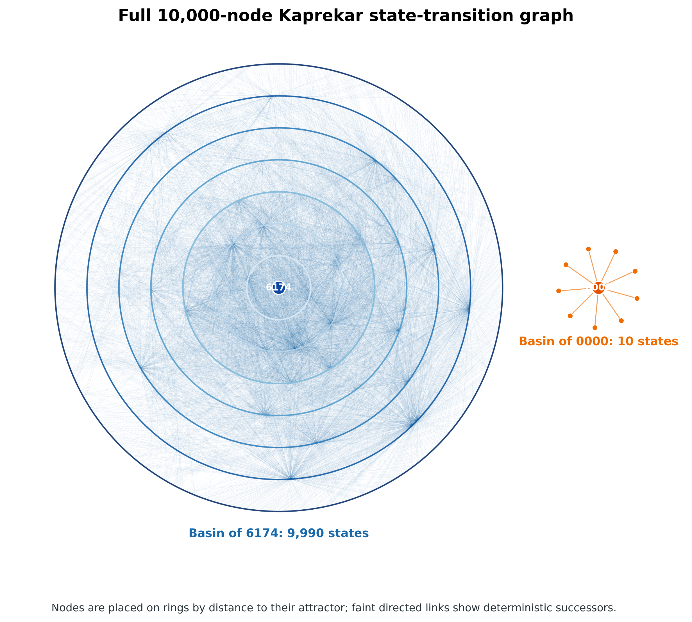</a>
</p>

**Figure 1.** Full structural graph without 10,000 labels. Rings encode distance to an attractor; the small orange component is the repdigit basin.

#### 4.2 Convergence-time distribution

Every valid state reached 6174 within seven transformations, so the experiment reproduces the famous bound over the complete zero-padded domain. Table 3 gives the full distribution. Percentages use 9,990 valid states in the first pair of columns and 8,991 valid ordinary integers in the second.

**Table 3. Transformations required to first reach 6174.**

| Transformations | All valid states | Percent | Valid ordinary integers | Percent |
|---:|---:|---:|---:|---:|
| 0 | 1 | 0.010% | 1 | 0.011% |
| 1 | 383 | 3.834% | 356 | 3.960% |
| 2 | 576 | 5.766% | 519 | 5.772% |
| 3 | 2,400 | 24.024% | 2,124 | 23.624% |
| 4 | 1,272 | 12.733% | 1,124 | 12.501% |
| 5 | 1,518 | 15.195% | 1,379 | 15.338% |
| 6 | 1,656 | 16.577% | 1,508 | 16.772% |
| 7 | 2,184 | 21.862% | 1,980 | 22.022% |
| **Total** | **9,990** | **100.000%** | **8,991** | **100.000%** |

Across all valid states, the minimum was 0, maximum 7, mean 4.668368, median 5, and population standard deviation 1.775777. Restricting to valid ordinary integers changed these only slightly: mean 4.678567, median 5, and population standard deviation 1.780749.

<p align="center">
  <a href="figures/figure_1_iteration_distribution.png">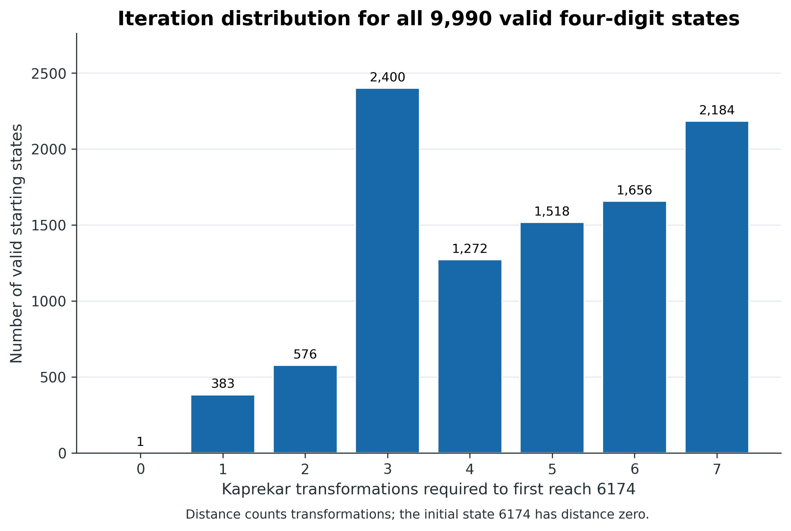</a>
</p>

**Figure 2.** Frequency distribution of $T(n)$ over all valid zero-padded states.

The basin-depth plot adds the repdigit component and makes clear that its nine nonzero repdigits lie one step from 0000.

<p align="center">
  <a href="figures/figure_3_basin_depth.png">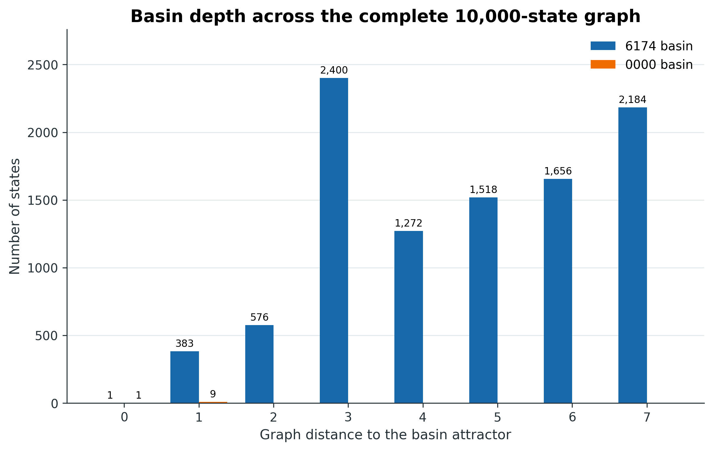</a>
</p>

**Figure 3.** Number of states at each graph distance from their terminal attractor.

#### 4.3 The 2,184 seven-step cases

All 2,184 maximum-distance states are listed in [`tables/maximum_distance_states.csv`](tables/maximum_distance_states.csv). They occupy 116 permutation classes, listed in [`tables/maximum_distance_permutation_classes.csv`](tables/maximum_distance_permutation_classes.csv). The class reduction exposes a strong digit pattern: every seven-step start has either three distinct digits, producing a 12-member class, or four distinct digits, producing a 24-member class. Specifically, 50 three-distinct-digit classes contribute 600 states and 66 all-distinct classes contribute 1,584 states. No one- or two-distinct-digit class has distance seven.

The 116 classes collapse further to only eight possible first outputs. Table 4 is therefore a compact structural listing of every maximum case. A start requires seven steps exactly when its sorted digits yield one of the eight $(x,y)$ rows below.

**Table 4. Structural classification of all seven-step states.**

| $x$ | $y$ | First output | Starting states | Digit-multiset classes | Second output |
|---:|---:|---:|---:|---:|---:|
| 4 | 1 | `4086` | 432 | 24 | `8172` |
| 5 | 1 | `5085` | 480 | 25 | `7992` |
| 5 | 2 | `5175` | 360 | 20 | `5994` |
| 6 | 1 | `6084` | 480 | 24 | `8172` |
| 8 | 5 | `8442` | 144 | 8 | `5994` |
| 9 | 4 | `9351` | 120 | 6 | `8172` |
| 9 | 5 | `9441` | 96 | 5 | `7992` |
| 9 | 6 | `9531` | 72 | 4 | `8172` |
| **Total** |  |  | **2,184** | **116** |  |

After two transformations, even these eight cases have merged into only three six-state trunks:

```text
8172 -> 7443 -> 3996 -> 6264 -> 4176 -> 6174
7992 -> 7173 -> 6354 -> 3087 -> 8352 -> 6174
5994 -> 5355 -> 1998 -> 8082 -> 8532 -> 6174
```

Examples of complete seven-step trajectories are:

```text
1240 -> 4086 -> 8172 -> 7443 -> 3996 -> 6264 -> 4176 -> 6174
1250 -> 5085 -> 7992 -> 7173 -> 6354 -> 3087 -> 8352 -> 6174
2500 -> 5175 -> 5994 -> 5355 -> 1998 -> 8082 -> 8532 -> 6174
5800 -> 8442 -> 5994 -> 5355 -> 1998 -> 8082 -> 8532 -> 6174
```

Permutation-equivalent starting strings necessarily have the same successor because sorting erases their original order. They therefore have identical trajectories after the first transformation. Their starting distances are also identical except for one subtle class: the 24 permutations of digits `1467` all map to 6174, but `6174` itself has distance 0 while its other 23 permutations have distance 1. This is the sole permutation class with nonuniform starting distance.

#### 4.4 First-step compression and reduced state space

The 10,000-state problem admits three related reductions:

**Table 5. State-space reductions.**

| Representation | Count |
|---|---:|
| Original four-digit states | 10,000 |
| Sorted-digit permutation classes | 715 |
| Feasible $(x,y)$ pairs | 55 |
| Unique one-step outputs | 55 |
| Unique outputs from valid states | 54 |
| Terminal attractors | 2 |

The one missing valid output is 0000, which can be produced only when `x = y = 0`, equivalently from a repdigit. If arbitrary starting states are counted as part of their trajectories, 9,990 distinct states appear somewhere in valid trajectories—the valid starting set itself. The structurally informative post-first-step count is only 54. Thus “unique states appearing in valid trajectories” must be qualified by whether initial states are included.

<p align="center">
  <a href="figures/figure_4_first_step_compression.png">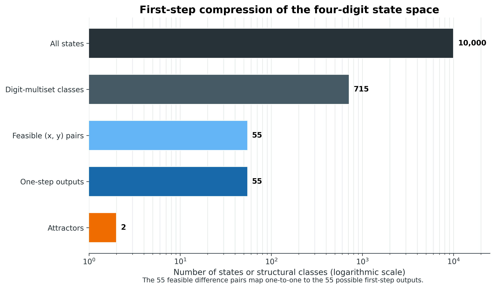</a>
</p>

**Figure 4.** Successive structural reductions. The logarithmic scale makes the fall from 10,000 states to 55 outputs visible.

The 55 possible successors form a closed set: applying `K` to any of them produces another member of the same set. Their reduced graph is readable enough to label individually.

<p align="center">
  <a href="figures/figure_2b_reduced_55_state_graph.png">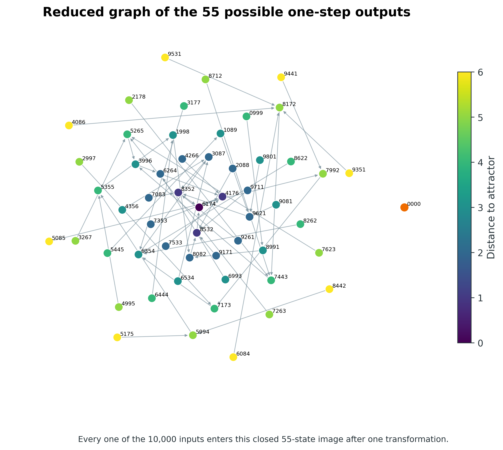</a>
</p>

**Figure 5.** Directed graph induced by all possible one-step outputs. The isolated orange fixed point is 0000; the remaining 54 nodes feed 6174.

The feasible difference pairs form a triangular lattice. Color in Figure 6 gives the remaining distance of the corresponding output $K(n)$ to 6174; marker area reflects how many original states yield the pair.

<p align="center">
  <a href="figures/figure_5_xy_reduced_state_space.png">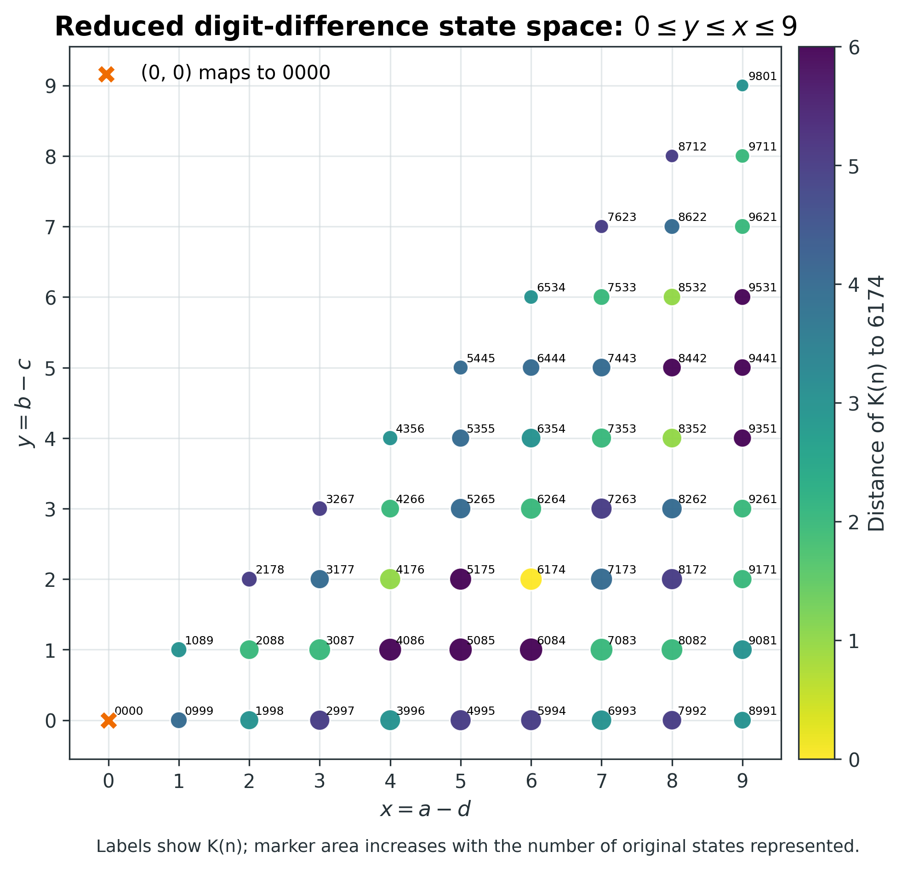</a>
</p>

**Figure 6.** The 55 pairs $0\le y\le x\le9$ and their unique Kaprekar outputs.

The permutation quotient retains 715 nodes but eliminates positional redundancy.

<p align="center">
  <a href="figures/figure_2d_permutation_class_graph.png">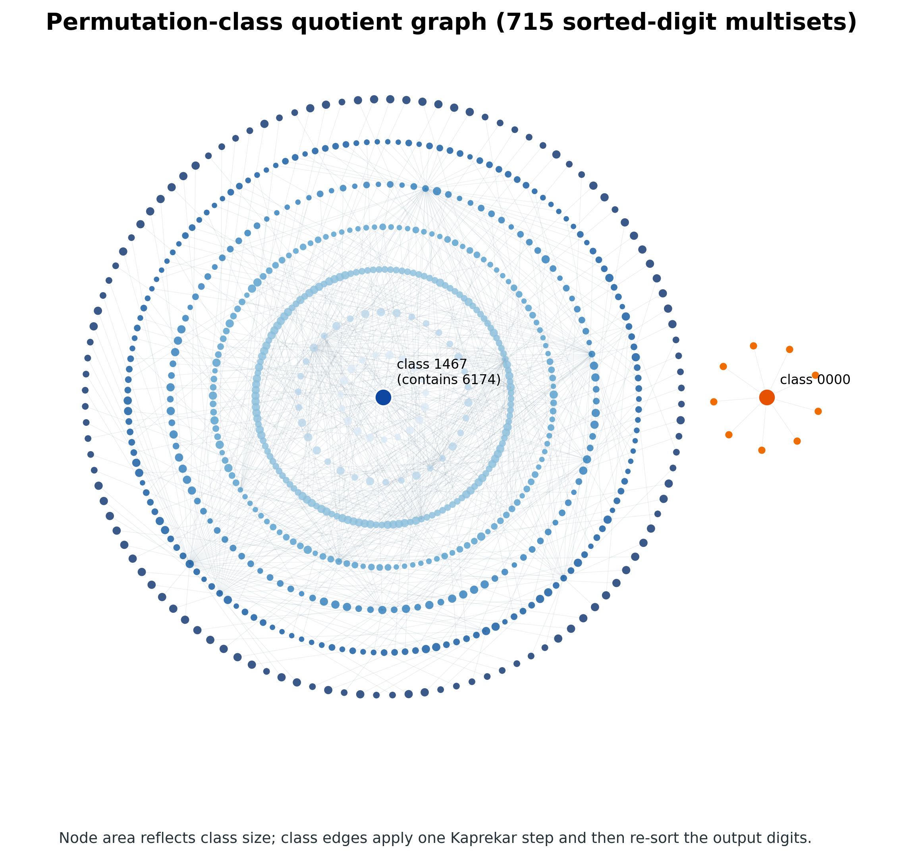</a>
</p>

**Figure 7.** Quotient graph on sorted-digit multisets. Node area represents the number of distinct permutations in a class.

#### 4.5 Direct predecessors and trajectory frequency

Direct predecessor counts are highly uneven. Only 55 of the 10,000 nodes have positive indegree; the other 9,945 can occur only as chosen initial states and never as subtraction results. The largest indegree is 480, shared by 5085 and 6084.

**Table 6. Ten largest direct predecessor counts.**

| Rank | State | Direct predecessors |
|---:|---:|---:|
| 1 | `5085` | 480 |
| 2 | `6084` | 480 |
| 3 | `4086` | 432 |
| 4 | `7083` | 432 |
| 5 | `6174` | 384 |
| 6 | `5175` | 360 |
| 7 | `7173` | 360 |
| 8 | `3087` | 336 |
| 9 | `8082` | 336 |
| 10 | `4176` | 288 |

The full 10,000-row indegree table is [`tables/predecessor_counts.csv`](tables/predecessor_counts.csv), while [`tables/trajectory_state_frequency.csv`](tables/trajectory_state_frequency.csv) records both direct indegree and frequency across complete valid trajectories. Large indegree identifies compression hubs, but trajectory frequency can be still larger because descendants inherit flow from multiple hubs.

<p align="center">
  <a href="figures/figure_6_predecessor_distribution.png">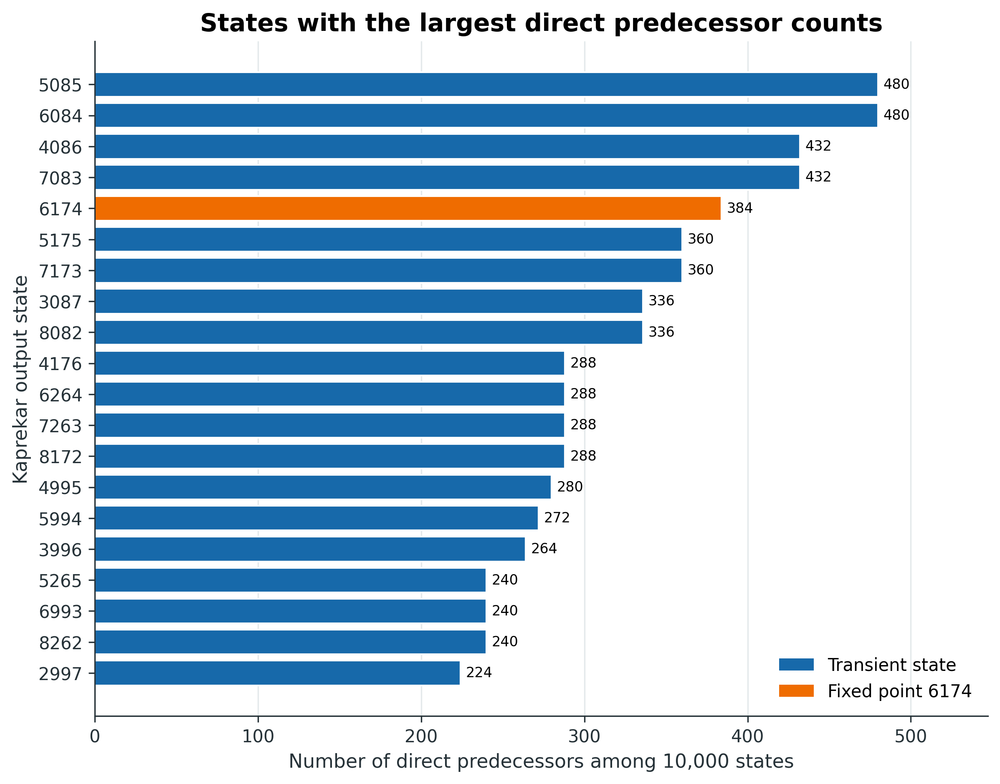</a>
</p>

**Figure 8.** The twenty states with greatest direct indegree. The fixed point 6174 is highlighted.

#### 4.6 Graph structure by depth

Because every non-fixed node in a basin is one transformation closer to its terminal cycle, the full graph can be aggregated without ambiguity by distance. Figure 9 makes the funnel structure explicit: each layer maps into the layer immediately to its right.

<p align="center">
  <a href="figures/figure_2c_graph_grouped_by_distance.png">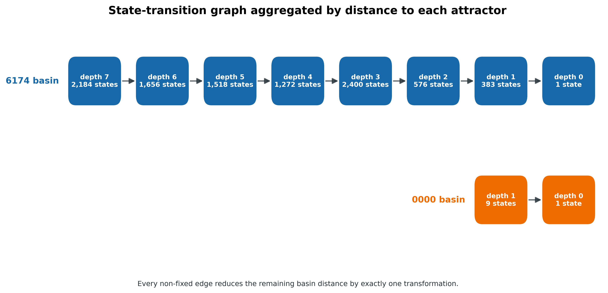</a>
</p>

**Figure 9.** The deterministic transition graph aggregated by basin and remaining depth.

The absence of non-trivial cycles was not presumed. It was found twice: once from repeated-state trajectories and again from cyclic strongly connected components. Both methods produced only `{0000}` and `{6174}`.

### 5. Mathematical Interpretation

#### 5.1 Why permutations merge immediately

Sorting maps every ordering of a fixed multiset to the same pair $(D,A)$. Therefore all permutations share the same first edge. A four-distinct-digit class may contain 24 visibly different strings, yet the graph forgets all 24 orderings after a single step. Repeated digits reduce the class size to 12, 6, 4, or 1 according to the usual multinomial count, but the invariance remains exact.

This also explains the one exception in classwise starting distance. A quotient node records a multiset, not a particular ordered string. The class `1467` maps back to itself at the quotient level because its successor 6174 has the same multiset. At the original node level, only the ordering 6174 is fixed; its 23 siblings take one edge to it.

#### 5.2 Why 10,000 states collapse to 55

Permutation invariance alone reduces the domain to 715 classes, but the algebraic formula is stronger. The output depends only on the two gaps (a-d) and (b-c), not on the absolute digits. Many different multisets share those gaps. The inequalities `0 ≤ y ≤ x ≤ 9` leave only 55 feasible pairs, and the injectivity argument shows exactly one output per pair. The computational counts 55 and 55 are therefore explained analytically rather than observed accidentally.

The same formula gives additional structure. Every output is divisible by 9 because both 999 and 90 are divisible by 9. The map consequently enters a very sparse arithmetic subset after one step. That subset is also closed under subsequent transformations, producing the compact 55-node graph in Figure 5.

#### 5.3 Why the funnel is fast

The first application performs most of the compression: 10,000 possible starts merge into 55 nodes. Only 54 of those are accessible from valid inputs, and the longest of their remaining paths has length 6. At maximum distance, eight of the 54 outputs suffice, and the next application merges them to three trunks. Rapid convergence is therefore not a uniform numerical “pull” toward 6174; it is repeated many-to-one identification in a small functional graph.

#### 5.4 Fixed points and finite verification

Substitution verifies that 6174 is fixed:

```text
7641 − 1467 = 6174.
```

Likewise 0000 is fixed. Showing that these are the only terminal cycles is more global. The exhaustive search provides a proof by complete finite enumeration for precisely the modeled domain, provided the implementation and execution are correct. Confidence is strengthened by the independent literal transformation, the independent algebraic check, the exact row coverage test, and the graph/trajectory agreement.

This is different from an analytic proof that derives the seven-step bound symbolically without checking cases. It is also not evidence for arbitrary bases or digit lengths. Its force comes from the finiteness and complete coverage of this specific 10,000-element system.

### 6. Discussion

The experiment establishes a complete census, not merely the headline convergence claim. It distinguishes the 10,000 four-character states from the 9,000 ordinary four-digit integers, keeps the repdigit basin visible, quantifies every convergence depth, and produces a machine-auditable list of all maximum cases. The central findings agree with the known literature: published work states that nontrivial four-digit base-10 inputs reach 6174 within seven iterations [3, 4]. The contribution here is an independently reproducible dataset and a layered structural explanation.

Several results are especially revealing. First, the largest frequency class is the maximum-distance class: 2,184 states, or 21.862% of valid starts, take seven transformations. “At most seven” should not be read as an extremely rare worst case. Second, those 2,184 values are structurally far less diverse than their raw count suggests. Only eight first outputs and three next-stage trunks control all of them. Third, direct indegree is extremely concentrated. The map is a many-to-one compressor immediately, long before trajectories visibly approach 6174.

The project also illustrates a general strategy for finite discrete dynamics:

1. define the state representation without ambiguity;
2. implement the local map independently in more than one way;
3. enumerate every node and successor;
4. locate cycles generically;
5. quotient by exact symmetries;
6. search for lower-dimensional coordinates that explain the quotient.

In this case, sorted digit multisets supply the symmetry quotient and $(x,y)$ supplies the lower-dimensional coordinate system.

### 7. Extensions

The generalized extension, presented in Part II, exactly surveys bases 2–16 and widths 2–6, representing 50,871,747 ordered states through 244,999 weighted digit-multiset classes. It exports every attractor, basin, and depth distribution and compares the 75 systems with six new figures. The source API preserves fixed width in bases 2 through 36.

- **Three decimal digits.** The familiar nontrivial fixed point is 495. The literature gives a complete convergence analysis for the three-digit case and shows the behavior depends on the parity of the base [4]. A direct decimal experiment can repeat this project's census on only 1,000 states.
- **Two decimal digits.** A unique nonzero global attractor should not be presumed; finite trajectories may enter cycles. The generic cycle detector already supports this case.
- **Five and six digits.** Published computational investigations report substantially richer fixed-point and cycle behavior as width changes [5]. The correct question becomes a census of attractors and basins, not “what is the constant?”
- **Other bases.** Devlin and Zeng classify maximum distances for several families of four-digit bases and obtain `M₁₀ = 7` as one instance of a base-dependent problem [4]. Kay and Downes-Ward show that odd bases exhibit rich families of fixed points and cycles [6].

For each surveyed `(digits, base)` pair, the new pipeline generates its state count, fixed points, non-trivial cycles, basin sizes, weighted convergence statistics, and maximum transient depth. Because each system is finite, apparently divergent behavior is necessarily eventual periodicity.

### 8. Limitations

1. **Domain specificity.** The conclusions apply to fixed-width, four-digit, base-10 strings. They do not automatically generalize to other widths, bases, or conventions that discard leading zeros.
2. **Computational proof assumptions.** Complete enumeration proves a finite claim only conditional on the correctness of the program, interpreter, and execution. Independent formulations reduce implementation risk but do not replace formal verification.
3. **Visualization loss.** A 10,000-edge directed graph cannot be labeled legibly. The full graph emphasizes global structure, while reduced and aggregated views carry the readable detail. No single figure preserves every local edge and every label.
4. **Frequency definition.** “Appears in a trajectory” depends on whether arbitrary starting states and repeated closing states are counted. The project exports explicit containing-trajectory and post-first-step measures to avoid hiding this ambiguity.
5. **Finite rather than fully symbolic proof.** Part III analytically derives the 55-pair reduction and checks all reduced transitions, but it does not replace that finite certificate with a region-by-region symbolic derivation.

### 9. Conclusion

The four-digit Kaprekar routine is a compact but instructive deterministic system. Exhaustive analysis of all 10,000 zero-padded states found exactly two fixed points and no non-trivial cycles. Every one of the 9,990 non-repdigits reached 6174 in at most seven transformations; every repdigit reached 0000. The valid mean distance was 4.6684, the median was 5, and 2,184 starts attained the sharp maximum of 7.

The most important explanation lies in the state-space reductions. Digit order is irrelevant after one transformation, reducing 10,000 strings to 715 multisets. More strongly, `K(n) = 999x + 90y` depends only on two constrained digit gaps. Exactly 55 pairs are possible, so exactly 55 first outputs exist. Maximum-distance starts use only eight of them and merge to three trunks one step later. The famous convergence is therefore the visible endpoint of an aggressive many-to-one compression process.

All numerical claims are reproducible from the supplied code, complete dataset, summary JSON, CSV tables, and figures. The experiment confirms the classical result while exposing the graph and equivalence-class structure that a recreational demonstration usually leaves unseen.

## Part II — Generalized Kaprekar systems

### 1. Research design

For base $b$ and width $d$, the state space contains $b^d$ zero-padded strings. Exactly $b$ are repdigits, leaving $b^d-b$ valid states. Direct enumeration over the selected grid would visit 50,871,747 states. Instead, the experiment groups strings by sorted digit multiset. A multiset with digit multiplicities $m_i$ represents exactly

```text
d! / (m₀! m₁! ⋯ mₖ!).
```

ordered strings, all of which have the same first successor.

The analyzer enumerates every multiset, constructs the closed functional graph of unique outputs, discovers cycles generically, and propagates terminal cycles and depths backward. Basin statistics are then recovered exactly from multinomial weights. If a class contains a cycle node, that one ordering is counted at depth zero and the remaining permutations are counted after their shared first edge. This prevents quotienting from hiding the distinction between a fixed or periodic ordering and its non-periodic permutations.

### 2. Survey-wide results

- Systems analyzed: **75**.
- Ordered states represented: **50,871,747**.
- Weighted permutation classes: **244,999**.
- Attractor records discovered: **199**.
- Systems with one valid attractor: **42**.
- Systems containing non-trivial cycles: **52**.
- Largest attractor count: **8**, attained by base 15, width 4.
- Largest valid transient depth: **31**, attained by base 16, width 6.
- Longest terminal cycle: **14 states**, attained by base 9, width 6.

<p align="center">
  <a href="figures/generalized/figure_g1_attractor_count_heatmap.png">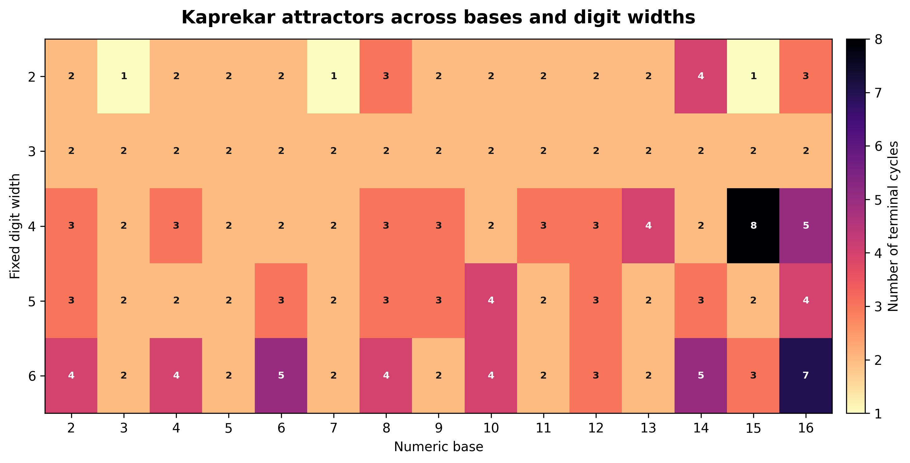</a>
</p>

**Figure G1.** Number of terminal cycles, including the zero fixed point, in every surveyed system.

<p align="center">
  <a href="figures/generalized/figure_g2_nontrivial_cycle_heatmap.png">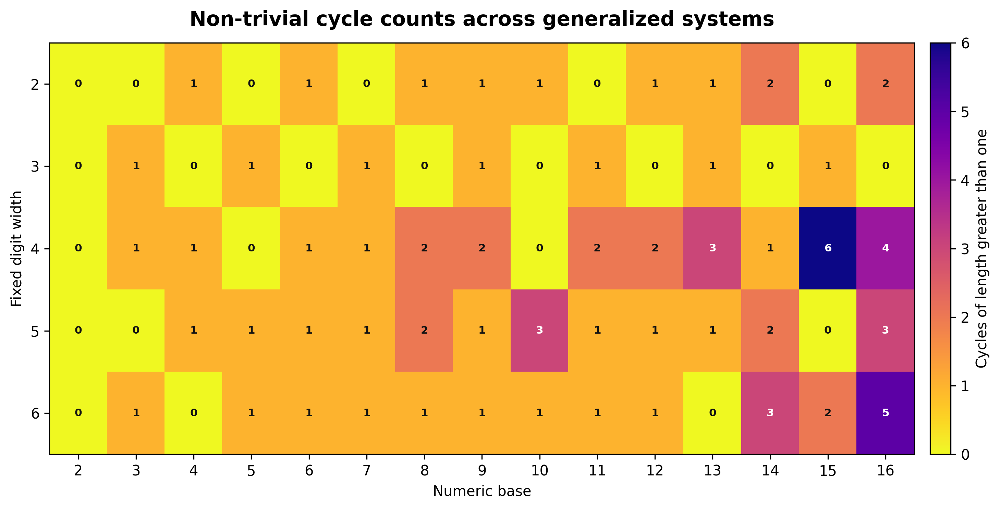</a>
</p>

**Figure G2.** Number of cycles of length greater than one.

<p align="center">
  <a href="figures/generalized/figure_g3_maximum_depth_heatmap.png">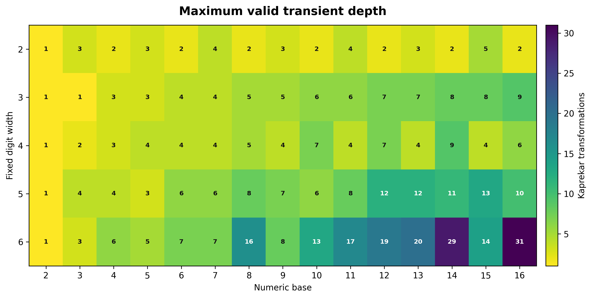</a>
</p>

**Figure G3.** Maximum transformations required for a valid state to enter its terminal cycle.

<p align="center">
  <a href="figures/generalized/figure_g4_maximum_cycle_length_heatmap.png">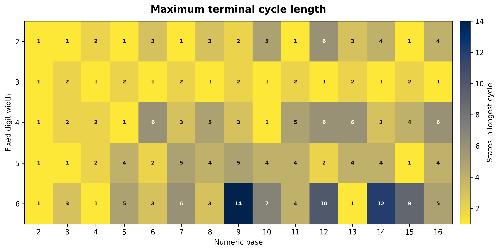</a>
</p>

**Figure G4.** Length of the longest terminal cycle in each system.

<p align="center">
  <a href="figures/generalized/figure_g5_largest_basin_share_heatmap.png">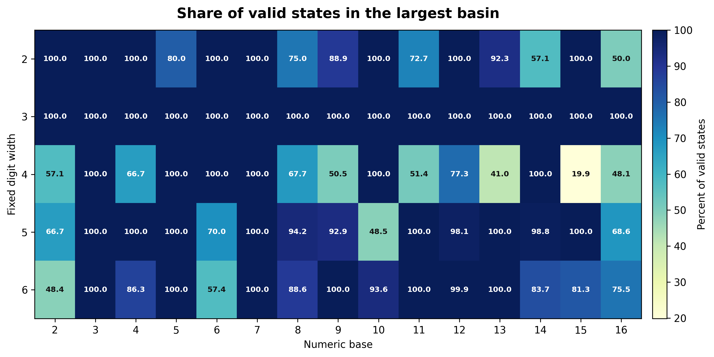</a>
</p>

**Figure G5.** Percentage of valid ordered states belonging to the largest valid basin.

### 3. Decimal widths 2–6

| Width | Valid states | Valid attractors | Non-trivial cycles | Maximum depth | Mean depth | Largest basin |
|---:|---:|---:|---:|---:|---:|---:|
| 2 | 90 | 1 | 1 | 2 | 1.3889 | 100.00% |
| 3 | 990 | 1 | 0 | 6 | 3.2414 | 100.00% |
| 4 | 9,990 | 1 | 0 | 7 | 4.6684 | 100.00% |
| 5 | 99,990 | 3 | 3 | 6 | 2.6483 | 48.48% |
| 6 | 999,990 | 3 | 1 | 13 | 5.2502 | 93.55% |

<p align="center">
  <a href="figures/generalized/figure_g6_base10_width_comparison.png">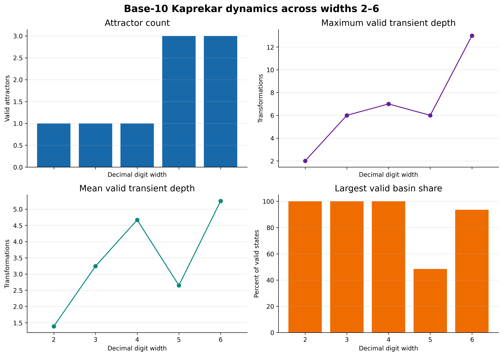</a>
</p>

**Figure G6.** Attractor and convergence statistics for decimal widths two through six. Width four is unusual in having unanimous convergence of valid states to the fixed point 6174; neighboring widths must be described in terms of multiple cycles or fixed points when the census reports them.

### 4. Finite proof certificate for 6174

Part III below proves the reduction from 10,000 four-digit decimal states to 55 digit-difference pairs and checks their complete transition graph. The 54 nonzero pairs all reach `(6,2)`, the pair representing 6174. Their maximum pair distance is six, which yields the sharp seven-transformation bound for original states.

### 5. Interpretation

The survey demonstrates that a Kaprekar “constant” is not the generic outcome of changing base or width. Every finite system eventually reaches a cycle, but the number, length, and basin balance of those cycles vary. The largest-basin heatmap distinguishes unanimous systems from systems in which several attractors compete, while the depth heatmap separates basin structure from convergence speed.

Symmetry weighting is exact because digit order is destroyed by the first transformation. It is also what makes the broader comparison practical: 244,999 classes replace 50,871,747 ordered starts without changing any basin total or depth frequency.

### 6. Limitations

- The census is complete only for the selected bases and widths.
- Exact class weighting depends on the standard fixed-width sort-and-subtract convention.
- Heatmaps summarize systems and cannot display every cycle; the attractor CSV is the authoritative detailed record.
- The proof certificate establishes the classical decimal four-digit theorem, not a universal theorem for the generalized grid.

### 7. Reproducibility and data

Run `python3 -m src.generalized_pipeline` from the project root. The pipeline regenerates:

- [`weighted_classes.csv`](data/generalized/weighted_classes.csv): every weighted digit-multiset class;
- [`generalized_summary.json`](data/generalized/generalized_summary.json): aggregate and per-system summaries;
- [`system_summary.csv`](tables/generalized/system_summary.csv): one row per surveyed system;
- [`attractors_and_basins.csv`](tables/generalized/attractors_and_basins.csv): every discovered terminal cycle;
- [`depth_distributions.csv`](tables/generalized/depth_distributions.csv): exact weighted depth counts;
- [`kaprekar_6174_pair_certificate.csv`](tables/generalized/kaprekar_6174_pair_certificate.csv): the checked 55-pair proof table.

#### Quick start

The exact tested environment is Python 3.13.12 with the package versions pinned in `requirements.txt`.

```bash
python3 -m venv .venv
source .venv/bin/activate
python3 -m pip install -r requirements.txt
python3 -m src.pipeline
python3 -m src.generalized_pipeline
python3 -m unittest discover -s tests -v
```

#### Repository navigation

- [`src/`](src/): transformation logic, exhaustive analyses, visualization, proof, and pipeline code
- [`tests/`](tests/): independent reference checks and generalized weighted-census tests
- [`data/`](data/): complete classical states and generalized weighted-class records
- [`tables/`](tables/): summaries, basins, depth distributions, and proof certificate
- [`figures/`](figures/): all plots in PNG and PDF formats
- [`requirements.txt`](requirements.txt): exact tested Python package versions

## Part III — Finite proof certificate for the seven-step 6174 bound

Every four-digit decimal state containing at least two distinct digits reaches 6174 in at most seven Kaprekar transformations. The bound is sharp.

### Analytic reduction

Let the sorted digits be $a \ge b \ge c \ge d$, and set

```text
x = a − d          y = b − c.
```

Direct subtraction gives

```text
K(n) = 999(a − d) + 90(b − c) = 999x + 90y.
```

The nested digit intervals imply $0 \le y \le x \le 9$. Conversely, every such pair is realized by sorted digits $(a,b,c,d)=(x,y,0,0)$, so there are

```text
1 + 2 + ⋯ + 10 = 55
```

feasible pairs. If two pairs have the same output, then

```text
999(x − x′) = −90(y − y′),
```

or $111(x-x')=-10(y-y')$. A nonzero left side has magnitude at least 111, whereas the right side has magnitude at most 90. Hence both differences are zero and the 55 outputs are distinct.

### Checked transition certificate

For a pair $p=(x,y)$, define

```text
F(p) = 999x + 90y
P(p) = the digit-difference pair of F(p).
```

The generated [55-row certificate](tables/generalized/kaprekar_6174_pair_certificate.csv) lists every feasible pair, $F(p)$, $P(p)$, its complete pair path, and its distance to a pair attractor. The checker establishes:

- `(0,0)` maps to itself and is the only pair in the 0000 basin;
- every one of the 54 nonzero pairs reaches `(6,2)`;
- `(6,2)` maps to itself and $F(6,2)=6174$;
- the largest pair-graph distance to `(6,2)` is 6;
- the eight distance-six witnesses are (4,1), (5,1), (5,2), (6,1), (8,5), (9,4), (9,5), (9,6).

### Translation to the original routine

Every non-repdigit start has a nonzero initial pair $p$. If that pair is at pair-graph distance $r$ from `(6,2)`, then after $r$ transformations the current state's pair is `(6,2)`, and one further transformation produces 6174. Therefore

```text
T(n) ≤ r + 1 ≤ 7.
```

The eight distance-six pairs are realizable by four-digit states, so starts with $T(n)=7$ exist. The full exhaustive dataset independently identifies 2,184 such ordered states. The special start 6174 itself has distance zero by convention.

### Nature of the proof

The reduction from 10,000 states to 55 pairs is analytic. The remaining claim is a transparent finite proof by complete enumeration of the 55 explicitly exported transitions. Automated tests regenerate the table, verify its invariants, and compare the underlying Kaprekar implementation with independent definitions.

## Reproducibility

The pipelines are deterministic. `src.pipeline` regenerates the complete 10,000-state decimal study. `src.generalized_pipeline` regenerates the 75-system census, proof certificate, figures, and this README. Custom inclusive grids are supported, for example:

```bash
python3 -m src.generalized_pipeline --bases 2:16 --digits 2:6
```

### Project structure

```text
src/                 Core maps, analysis, pipelines, figures, and report generation
tests/               Classical and generalized verification suites
data/                Full classical dataset and generalized weighted-class census
tables/              Classical and generalized machine-readable result tables
figures/             Classical and generalized PNG/PDF visualizations
requirements.txt     Python dependencies
.python-version      Exact Python version used for the published run
README.md            Complete report and repository documentation
```

### Validation strategy

The 24 tests compare the classical transformation with an independent literal implementation on all 10,000 states, verify the identity `K(n) = 999x + 90y` exhaustively, and compare the specialized and generalized decimal implementations. Generalized tests compare weighted symmetry results with brute-force ordered enumeration, verify multinomial totals and cycle-class depth splitting, test bases through 16, and regenerate every invariant in the 55-pair proof certificate.

## Artifact index

The principal machine-readable artifacts are:

- Classical 10,000-state dataset: [`data/kaprekar_results.csv`](data/kaprekar_results.csv)
- Classical numerical summary: [`data/analysis_summary.json`](data/analysis_summary.json)
- All 715 classical permutation classes: [`tables/permutation_classes.csv`](tables/permutation_classes.csv)
- All 55 classical difference pairs: [`tables/xy_reduced_states.csv`](tables/xy_reduced_states.csv)
- All 2,184 seven-step states: [`tables/maximum_distance_states.csv`](tables/maximum_distance_states.csv)
- Generalized 75-system summary: [`tables/generalized/system_summary.csv`](tables/generalized/system_summary.csv)
- Every generalized attractor and basin: [`tables/generalized/attractors_and_basins.csv`](tables/generalized/attractors_and_basins.csv)
- Exact weighted depth distributions: [`tables/generalized/depth_distributions.csv`](tables/generalized/depth_distributions.csv)
- All 244,999 weighted classes: [`data/generalized/weighted_classes.csv`](data/generalized/weighted_classes.csv)
- Generalized JSON summary: [`data/generalized/generalized_summary.json`](data/generalized/generalized_summary.json)
- The 55-row proof certificate: [`tables/generalized/kaprekar_6174_pair_certificate.csv`](tables/generalized/kaprekar_6174_pair_certificate.csv)

## References

1. D. R. Kaprekar, “Another Solitaire Game,” *Scripta Mathematica*, vol. 15, pp. 244–245, 1949. Bibliographic record maintained by the [University of Utah Mathematics Department](https://ftp.math.utah.edu/pub/tex/bib/scripta-math.html).
2. J. J. O'Connor and E. F. Robertson, “[Dattatreya Ramachandra Kaprekar](https://mathshistory.st-andrews.ac.uk/Biographies/Kaprekar/),” *MacTutor History of Mathematics Archive*, University of St Andrews.
3. D. Deutsch and B. Goldman, “Kaprekar's Constant,” *Mathematics Teacher*, vol. 98, no. 4, pp. 234–242, 2004. [ERIC record EJ717741](https://eric.ed.gov/?id=EJ717741).
4. P. Devlin and T. Zeng, “[Maximum Distances in the Four-Digit Kaprekar Process](https://math.colgate.edu/~integers/v97/v97.pdf),” *INTEGERS*, vol. 21, Article A97, 2021.
5. R. Ellis and J. Lewis, “[Investigations into the Kaprekar Process](https://scholar.rose-hulman.edu/rhumj/vol3/iss2/4/),” *Rose-Hulman Undergraduate Mathematics Journal*, vol. 3, no. 2, Article 4, 2002.
6. A. Kay and K. Downes-Ward, “[Fixed Points and Cycles of the Kaprekar Transformation: 1. Odd Bases](https://cs.uwaterloo.ca/journals/JIS/VOL25/Kay/kay5.pdf),” *Journal of Integer Sequences*, vol. 25, Article 22.6.7, 2022.
